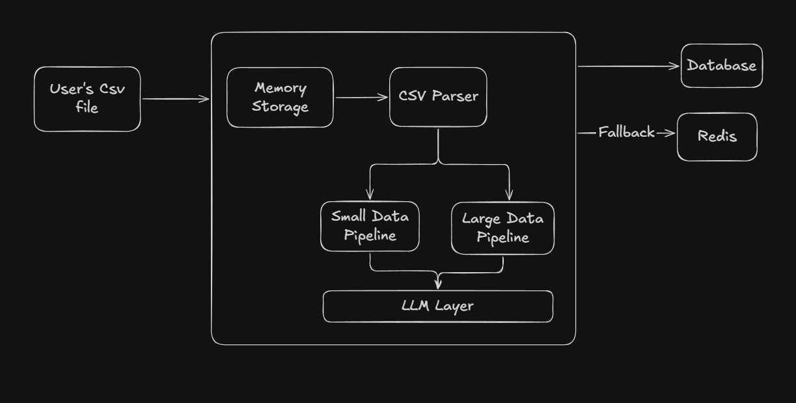

# CSV Insights Dashboard

An AI-powered application that analyzes CSV files to generate executive summaries, detect trends/outliers, and provide strategic recommendations.



## How to Run

### Prerequisites
- Node.js (v18+)
- PostgreSQL (running locally or cloud)
- Redis (running locally or cloud)
- Groq API Key

### 1. Backend Setup
```bash
cd Backend
npm install
npx prisma db push
npm run dev
```

### 2. Frontend Setup
```bash
cd Webapp
npm install
npm run dev
```

Visit `http://localhost:5174` to use the application.

## What is Done
- **Full Stack Architecture**: React (Vite) frontend + Node.js backend.
- **AI Analysis**: Integration with Groq (Llama 3) for deep insights.
- **Documentation**: Swagger UI API documentation for backend endpoints.
- **Testing**: Jest testing framework integration.
- **Scalable Parsing**: In-memory stream parsing to support cloud deployments (EC2/Serverless).
- **Dual Pipeline**: Specialized handling for Small (<500 rows) vs Large datasets.
- **Caching**: Redis caching for recent reports and fallback mechanism.
- **PDF Generation**: Client-side PDF export with charts and formatting.
- **Visualizations**: Automatic chart generation based on data distribution.
- **Robust Error Handling**: Frontend validation for empty/invalid files.

## What Could Be Better (Future Improvements)
- **Advanced Charts**: More chart types (Scatter, Line, Heatmap) with user configuration.
- **Large File Handling**: Currently limited to ~10MB/Memory limit. implementing getting S3 pre-signed URLs would allow huge file uploads.
- **Streaming Response**: Stream AI tokens to frontend for real-time feedback instead of waiting for full analysis.
